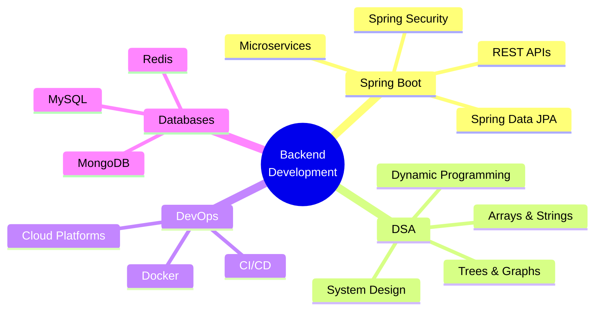

<div align="center">
  
</div>

<div align="center">
  
  [](https://git.io/typing-svg)
  
</div>

<br/>

## 🙋‍♂️ About Me
```yaml
name: Kartik Patel
located_in: Chennai, Tamil Nadu, India
current_education: B.Tech CSE (AI & Robotics) @ VIT Chennai
year: "Second Year"
interests: ["Backend Development", "System Design", "Problem Solving"]
currently_learning: ["Spring Boot", "RESTful APIs", "Microservices"]
future_goals: ["Secure backend role at product company", "Build scalable systems", "Master DSA"]
```


### 🎯 Quick Facts

- 🎓 Studying **Computer Science & Engineering** with specialization in **AI and Robotics**
- 💼 **Open to Backend Development Internships**
- 🔭 Currently building projects with **Spring Boot** and **Java**
- 🌱 Deep diving into **Data Structures & Algorithms**
- 💡 Passionate about creating efficient and scalable solutions
- 📧 Reach me at: **patelkartik1901@gmail.com**
- ⚡ Fun fact: I debug with coffee ☕

<br clear="right"/>

---

## 🛠️ Tech Stack & Tools

<div align="center">

### Languages & Frameworks
  


### Tools & Technologies


### Currently Exploring


</div>

---

## 📊 GitHub Analytics

<div align="center">
  
  
</div>

<div align="center">
  
</div>

<div align="center">
  
</div>

### 🏆 GitHub Trophies

<div align="center">
  
</div>

---

## 💻 Coding Profiles & Stats

<div align="center">

### LeetCode Journey
  
[](https://leetcode.com/Kartik_Patel19)

</div>

---

## 🎯 Current Focus Areas

<div align="center">


</div>

### 📚 Learning Path
```diff
✅ Core Java Fundamentals
✅ Object-Oriented Programming
✅ MySQL & Database Design
⏳ Spring Boot & Hibernate (In Progress)
⏳ Data Structures & Algorithms (Ongoing)
📋 System Design Basics (Planned)
📋 Microservices Architecture (Planned)
📋 Cloud Deployment (AWS/Azure) (Planned)
```

---

## 🚀 Featured Projects

> 🏗️ Building exciting projects! Check back soon for updates.

<div align="center">
  
<!-- Project cards will go here as you build them -->
<!-- Example:
[](https://github.com/KartikPatel-19/YOUR_REPO_NAME)
-->

</div>

---

## 🤝 Connect With Me

<div align="center">

[](https://www.linkedin.com/in/kartik-patel-b4b33b31b)
[](mailto:patelkartik1901@gmail.com)
[](https://github.com/KartikPatel-19)
[](https://leetcode.com/Kartik_Patel19)

</div>

---

## 💼 Open to Opportunities

<div align="center">
```diff
+ 🔍 Actively seeking Backend Development Internships
+ 💡 Interested in Spring Boot & Microservices projects
+ 🤝 Open to collaborative projects and open source contributions
+ 📧 Feel free to reach out for collaborations or opportunities!
```

</div>

---

## 📊 Profile Stats

<div align="center">
  


</div>

---

## 💭 Dev Quote of the Day

<div align="center">


</div>

---

## 🐍 Contribution Snake

<div align="center">
  


</div>

---

<div align="center">
  
### 💬 Show some ❤️ by starring some of the repositories!
  


</div>

---

<div align="center">
  <sub>Built with 💙 by Kartik Patel</sub>
</div>
